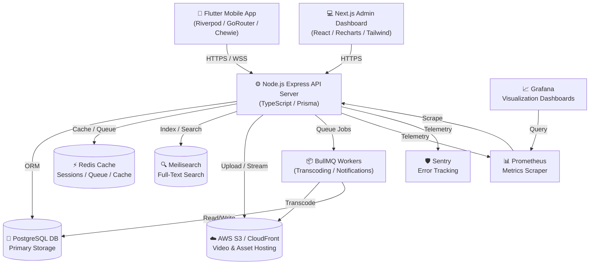

# 🌌 VANIX — Premium OTT Streaming Platform

Welcome to **VANIX**, a premium, state-of-the-art Over-The-Top (OTT) streaming platform designed for high-performance content delivery, real-time analytics, secure subscriptions, and an immersive user experience across devices. 

This repository contains the monorepo for the entire VANIX ecosystem, consisting of a high-performance **Node.js/TypeScript Backend**, an immersive **Flutter Mobile Application**, and a modern **Next.js Admin Dashboard**.

---

## 🏗️ Architecture & Component Overview



---

## 🛠️ Technology Stack

### 1. ⚙️ Backend API Server (`/backend`)
*   **Core**: Node.js & TypeScript with Express.
*   **Database & ORM**: PostgreSQL database powered by Prisma Client.
*   **Caching & Queueing**: Redis for fast session management, rate-limiting, and BullMQ background task processing (transcoding, notifications).
*   **Search**: Meilisearch for high-speed, relevant, full-text content searching.
*   **Telemetry & Observability**: Sentry for production exception logging, Prometheus for performance metrics, Grafana for server dashboards.
*   **Authentication**: Passwordless OTP flow, JWT access/refresh token management, Google OAuth.
*   **Payments**: Razorpay Node SDK for subscription billing and payment confirmation hooks.
*   **Storage**: AWS SDK v2/v3 for cloud storage uploads (posters, avatars) and media streaming integration.

### 2. 📱 Flutter Mobile App (`/app`)
*   **Framework**: Flutter (Dart) for natively compiled cross-platform iOS & Android targets.
*   **State Management**: Riverpod (`flutter_riverpod`, `riverpod_generator`) for declarative, robust state tracking.
*   **Navigation**: GoRouter for declarative, deep-link-ready navigation.
*   **Video Playback**: Chewie wrapper over official `video_player` with customizable subtitle/audio selection, resolution controls, and custom overlay controls.
*   **Networking**: Dio HTTP client with JWT interceptors, automatic token refresh, and retry capabilities.
*   **Design & UI**: Premium dark mode theme using Google Fonts (`Orbitron`, `Montserrat`, `Poppins`), shimmering placeholders, Custom animations with Lottie, and dynamic list carousels.

### 3. 💻 Next.js Admin Dashboard (`/admin`)
*   **Framework**: Next.js (React 18) using TypeScript and App Router.
*   **Styling**: Vanilla CSS alongside Tailwind CSS configurations.
*   **Charts & Visualizations**: Recharts for custom graphs showing active views, subscriptions, signup rates, and revenue.
*   **Forms**: React Hook Form with Zod schema verification.
*   **Icons**: Lucide React.

---

## 📂 Repository Directory Structure

```text
vanixx/
├── admin/                  # Next.js Admin Panel
│   ├── src/
│   │   └── app/            # App Router files (pages, layouts, globals.css)
│   ├── next.config.js      # Next.js Configuration
│   └── package.json        # NextJS dependencies & build scripts
├── app/                    # Flutter Mobile Application
│   ├── assets/             # Brand fonts, icon vectors, animations
│   ├── lib/
│   │   ├── core/           # Routing, providers, API services, theme, shared widgets
│   │   └── features/       # Feature modules: auth, home, search, content, profile
│   └── pubspec.yaml        # Flutter project packages and dependencies
└── backend/                # Express API Service
    ├── src/
    │   ├── config/         # System environment configurations & logging setup
    │   ├── middleware/     # Auth, rate-limiter, validator, error handlers
    │   ├── modules/        # Domain-driven backend modules (auth, content, billing, recommendations, etc.)
    │   └── server.ts       # Express app and database connections
    ├── prisma/             # Prisma ORM Schema & database seeding script
    ├── monitoring/         # Prometheus configurations
    ├── docker-compose.yml  # Dockerized environment dependencies (Postgres, Redis, Meilisearch, Grafana)
    └── package.json        # Node.js backend commands and dependencies
```

---

## 🚀 Getting Started & Local Setup

### 📋 Prerequisites
Ensure you have the following installed on your machine:
*   [Docker & Docker Compose](https://www.docker.com/products/docker-desktop/)
*   [Node.js (v20 or above)](https://nodejs.org/)
*   [Flutter SDK (v3.2.0 or above)](https://docs.flutter.dev/get-started/install)

---

### Step 1: Initialize Database & Infrastructure (`/backend`)

The backend requires external databases and search/caching services. We provide a single-command setup using Docker Compose.

1.  Open your terminal and navigate to the backend directory:
    ```bash
    cd backend
    ```
2.  Copy the environment template file and modify the values if necessary:
    ```bash
    cp .env.example .env
    ```
3.  Start the infrastructure services (PostgreSQL, Redis, Meilisearch, Prometheus, Grafana):
    ```bash
    docker-compose up -d
    ```
4.  Verify that all containers are healthy:
    ```bash
    docker-compose ps
    ```
5.  Install backend Node packages:
    ```bash
    npm install
    ```
6.  Generate the Prisma client and apply migration files to the database:
    ```bash
    npx prisma generate
    npx prisma migrate dev
    ```
7.  Run the database seed script to populate test content (users, movies, plans, etc.):
    ```bash
    npm run prisma:seed
    ```
8.  Start the backend developer environment:
    ```bash
    npm run dev
    ```
    The server will run on `http://localhost:4000/api/v1`.

---

### Step 2: Running the Next.js Admin Panel (`/admin`)

The admin dashboard interacts with the backend to view system analytics, manage content catalogs, and review payments.

1.  Navigate to the admin directory:
    ```bash
    cd admin
    ```
2.  Install dependencies:
    ```bash
    npm install
    ```
3.  Start the Next.js development server:
    ```bash
    npm run dev
    ```
    Open `http://localhost:3000` in your web browser.

---

### Step 3: Running the Flutter App (`/app`)

The Flutter application is set up with a comprehensive interface showcasing the streaming platform.

1.  Navigate to the app directory:
    ```bash
    cd app
    ```
2.  Fetch packages and dependencies:
    ```bash
    flutter pub get
    ```
3.  Run code generator scripts (for Riverpod annotations, etc.):
    ```bash
    flutter pub run build_runner build --delete-conflicting-outputs
    ```
4.  Run the application on a connected mobile emulator or physical device:
    ```bash
    flutter run
    ```
    *Note: When debugging on Android Emulator, change the base URL configuration in the Flutter app to `http://10.0.2.2:4000/api/v1` to point to the local backend.*

---

## ⚙️ Key Backend Scripts

Run these commands inside the `/backend` directory:
*   `npm run dev`: Starts the TypeScript dev server with live reload.
*   `npm run build`: Compiles the TypeScript application into vanilla JavaScript in the `/dist` directory.
*   `npm run start`: Runs the production-built code from `/dist`.
*   `npm run prisma:studio`: Opens a browser interface to view and edit database records directly.
*   `npm run test`: Executes the unit & integration test suites.

---

## 📈 Monitoring & Telemetry URLs

When running with `docker-compose`, the monitoring setup is available at:
*   **Grafana Dashboard**: `http://localhost:3001` (Default login: `admin` / `vanix-grafana-admin`)
*   **Prometheus**: `http://localhost:9090`
*   **Meilisearch API**: `http://localhost:7700` (Master key: `vanix-search-master-key`)

---

## 🧑‍💻 Architecture Design Principles

### Clean Architecture & Domain Driven Modules
The API is split into independent domains located within `src/modules`. Each module is encapsulated and controls its own:
*   `*.routes.ts` - HTTP request routing.
*   `*.controller.ts` - Request validation mapping and HTTP response wrapping.
*   `*.service.ts` - Pure business logic and database queries.
*   `*.validators.ts` - Input payload assertions via Zod schemas.

### Immersive Video Playback
The Flutter video player uses full landscape control integration via `SystemChrome`. Custom overlays manage skip-intro markers, quality resolution swapping, and analytics pings, sending live progress check-ins to `/api/v1/streaming/progress` every 30 seconds to support a seamless "continue watching" flow.
